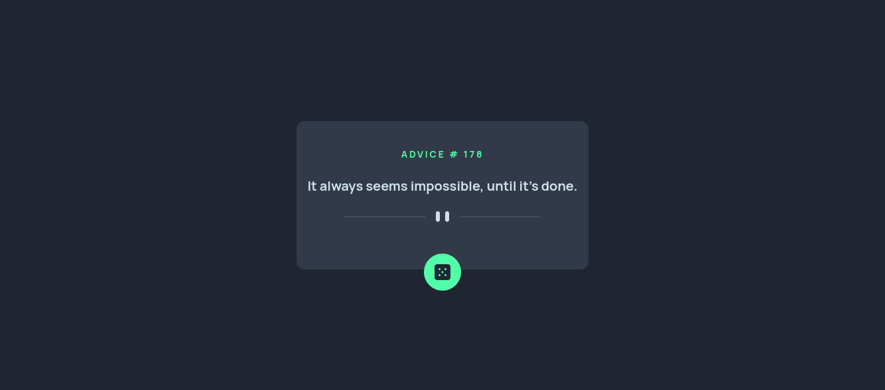

# Frontend Mentor - Advice generator app solution

This is a solution to the [Advice generator app challenge on Frontend Mentor](https://www.frontendmentor.io/challenges/advice-generator-app-QdUG-13db).

## Table of contents

- [Screenshot](#screenshot)
- [Links](#links)
- [Built with](#built-with)
- [Acknowledgments](#acknowledgments)

## Screenshot

## Links

- [Advice Generator - Frontend Mentor](https://www.frontendmentor.io/solutions/advice-generator-2Se-IU3L6I)
- [Advice Generator - Vercel app](https://xviigimenez-advice-generator.vercel.app/)

## Built with

- [React](https://reactjs.org/) - JS library
- [Next.js](https://nextjs.org/) - React framework
- [Tailwind CSS](https://tailwindcss.com/) - CSS framework

## Acknowledgments

Thanks a lot to [Guilherme Figueira](https://github.com/GuilhermeFigueira).
